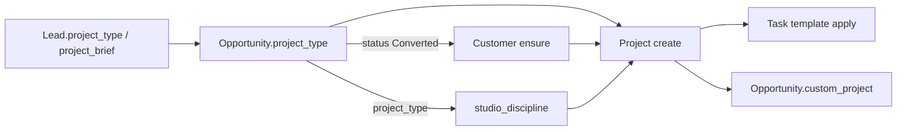
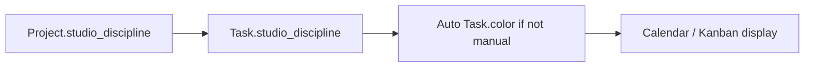
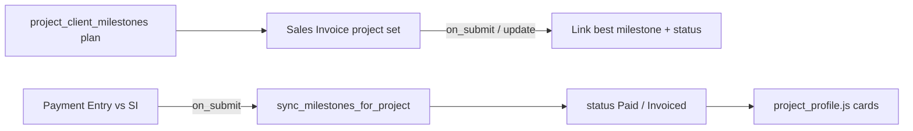
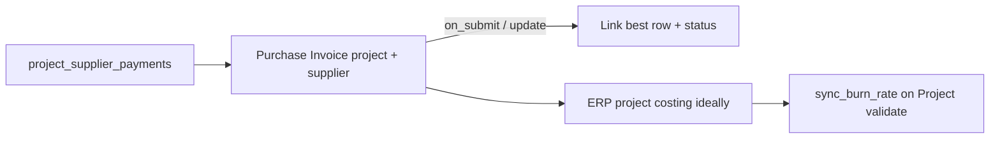

# Spaces — Domain Ontology

**Purpose:** Glossary, single sources of truth (SSOT), bounded contexts, and **influence / effect graph** for the architecture-studio vertical.  

**Status:** Foundation v1, refreshed 2026-08-24 against live Studio Web. VPS / GitHub product tip: `912e9e3`. Dated live-vs-local: [GAP-ANALYSIS-2026-08-24.md](../03-product/GAP-ANALYSIS-2026-08-24.md). Historical W6/W7 feature ship: `4957699`.

**Does not replace:** [SPACES-CONTRACTS.md](./SPACES-CONTRACTS.md) (invariants / footguns) or [JOURNEY-MATRIX.md](./JOURNEY-MATRIX.md) (path tests). This doc answers **what things mean** and **what writes what**.

**Related:** [PRODUCT-GLOSSARY.md](../03-product/PRODUCT-GLOSSARY.md) · [PLATFORM-GLOSSARY-AND-FUNCTIONS.md](../03-product/PLATFORM-GLOSSARY-AND-FUNCTIONS.md) · [ASSIGNMENT.md](./ASSIGNMENT.md) · [ONTOLOGY-JTBD-ALIGNMENT.md](../03-product/ONTOLOGY-JTBD-ALIGNMENT.md) · [STUDIO-WORKFLOW.md](./STUDIO-WORKFLOW.md) · [FEATURE-GAPS.md](./FEATURE-GAPS.md) · [VERTICAL-STRATEGY.md](./VERTICAL-STRATEGY.md) · [PLATFORM-SITEMAP.md](./PLATFORM-SITEMAP.md)

---

## 0. How to use this doc

| When | Do this |
|------|---------|
| New money / status feature | Read §2 glossary + §3 SSOT + §5 write rules first |
| New desk UI | Map UI to a **context** (§1) and an **entity** (§4) |
| Hook or dual-write | Declare write owner per §5; add matrix row if path-sensitive |
| Gap work (G-PAY, G-COST, …) | Align names to glossary; do not invent parallel fields |

**Architecture stance (intentional)**  
- Vertical = **architecture / interior studio** on ERPNext documents.  
- **Not** a Hexagonal rewrite of Frappe.  
- “Clean” = clear SSOT + effect rules + bounded contexts inside one Frappe app (`spaces_studio`).

---

## 1. Bounded contexts

```text
┌─────────────┐   convert    ┌──────────────────┐
│  Pipeline   │ ───────────► │ Delivery (PM)    │
│ CRM         │              │ Tasks / time     │
└─────────────┘              └────────┬─────────┘
                                      │ same Project
┌─────────────┐   schedule   ┌────────▼─────────┐   invoices   ┌──────────┐
│ Commercial  │ ◄─────────── │ Project (hub)    │ ───────────► │ Finance  │
│ Profile     │   plan       │ ERP Project      │  cash/ledger │ Accounts │
└─────────────┘              └────────┬─────────┘              └──────────┘
                                      │
                             ┌────────▼─────────┐
                             │ Site & Buy       │
                             │ PO / PI / Issue  │
                             └──────────────────┘
```

| Context | Studio Web (daily) | Owns (intent) | Must not own |
|---------|--------------------|---------------|--------------|
| **Pipeline** | `/studio/pipeline` `/studio/clients` `/studio/opportunities` | Lead, Opportunity, Quotation, Customer | Project cost truth, cash |
| **Delivery** | `/studio/work` `/studio/projects` Activity | Task, File (work), Studio Activity | Double-entry ledger; new writes to `Project Update` |
| **Commercial** | Project command sheet (People, Overview, Docs, Variations) | Team, stakeholders, fee **plan**, supplier **plan**, material plan, job status, budget **intent** | Legal invoice, bank cash |
| **Finance** | `/studio/finance` plus job Money / Payments | Sales Invoice, Purchase Invoice, Payment Entry, JE, AR/AP/GL | Task colors, drawing files, bank-balance forecasts |
| **Site & Buy** | `/studio/site` | Material Request, PO, Supplier, Issue | Client fee schedule design |
| **Platform** | `/studio/admin` (Principal) | Company, User, roles, theme, domains | Job commercial truth |

Desk workspaces with the same names exist for infrastructure only.

**Hub rule:** Operational and commercial **plans** roll up to one **Project**. Legal money lives in Accounts DocTypes linked by `project`.

**Assignment (studio people)**  
- **Project:** several people via `Project Team Member` (one child table). One **Lead** (`Lead Architect / Designer`) also writes `Project.lead_architect` for capacity. Others are **Support** (`Designer`) or other studio roles on the command-sheet roster. External unnamed rows are kept. List-cell picker writer: `set_project_people`. Command-sheet People tab uses the same child table via team upsert / delete plus `lead_architect` patch. Do not add a second people table.  
- **Display:** Projects list shows a compact avatar stack (max two discs + `+N`) from `list_project_people`. Initials use `personInitials()` (emails use the local part).  
- **Task:** several people via `Task._assign` JSON only (W4). Writer: `set_task_people` (`studio_web.set_task_assignees` is the facade). **Lead** is index 0; **Support** is everyone after. No Informed writer on Task.

---

## 2. Glossary

### 2.1 Identity and type

**Product language (admin / support):** Prefer **studio project code** when speaking about a job on the phone. Prefer **ERP project id** only for system/API/accounting keys. Full product glossary: [PRODUCT-GLOSSARY.md](../03-product/PRODUCT-GLOSSARY.md).

| Term | Definition | Field / DocType | Not the same as |
|------|------------|-----------------|-----------------|
| **Project** | One job / engagement for a customer | DocType `Project` | Opportunity, Lead |
| **ERP project id** (system name) | Auto-generated primary key shown as `PROJ-0002`. Stable forever; used in URLs, APIs, and ledger links. | `Project.name` | Studio project code; project name |
| **Job Order** | Human job identity. **New:** `{YYMM}-{NNNN}` with one global, non-resetting sequence; assigned only by the backend at create; **immutable after save**; unique. Legacy freeform values remain stored. Does not replace `Project.name`. | `Project.studio_project_code` | ERP project id; project name; invoice numbers |
| **Project name** | Full human title of the job (site + scope language) | `project_name` | Studio project code (short); customer legal name |
| **Project category** (field still `studio_discipline`) | Design / Fitout / Printing / Construction (+ user-added). UI: **Category** | `Project.studio_discipline` | ERP native `project_type` Link (avoid). Legacy Interior/Exterior/… may remain on old rows |
| **Pipeline project type** | Category-style values on enquiry before convert | `Lead.project_type`, `Opportunity.project_type` | Copied toward project category on convert |
| **Design phase** | Legacy design progress (drawings): Brief → Concept → … → Handover | `Project.design_phase` | Prefer **Job status** as product SSOT |
| **Job status** (lifecycle status) | Single job status: Moodboard prep → Under design → Shop drawings preparation → Construction → On hold → Completed | `project_lifecycle_status` | Design phase; ERP open/closed. Product roadmap: [OWNER-PRODUCT-NOTES-ROADMAP.md](../03-product/OWNER-PRODUCT-NOTES-ROADMAP.md) |
| **ERP project status** | Books open/closed flag: Open / Completed / Cancelled | `Project.status` | Job status (lifecycle). Hidden on Studio Projects list |

**Identity examples (same job):**

| Studio project code | Project name | ERP project id |
|---------------------|--------------|----------------|
| `2608-0001` | Al Reem Villa Interior | `PROJ-0002` |

### 2.2 People and parties

| Term | Definition | Field / DocType |
|------|------------|-----------------|
| **Customer** | Billing / commercial party | DocType `Customer` |
| **Lead** | Unqualified enquiry | DocType `Lead` |
| **Opportunity** | Qualified job pursuit | DocType `Opportunity` |
| **Primary client contact** | Main person for the job | `primary_client_contact` → Contact |
| **Stakeholder** | Client-side people on the job | Child `Project Stakeholder` |
| **Legacy communication owner** | Historical follow-up-owner field retained for old records only; not used by Studio product logic. Not SPOC. | `communication_owner` → User (leftover stored) |
| **Lead architect / PM / execution lead** | Named role headers (also denormalized from team table). Product Lead is `lead_architect`. | User links on Project |
| **Team member** | Collaborator row on the job | Child `Project Team Member` |
| **People tab** | Job roster surface: job Lead card + Team Member list, plus stakeholders / partners / suppliers | Command sheet tab `people` |
| **People stack** | Compact Projects-list display of the roster (max two initials + overflow) | Derived from `list_project_people`; not a writer |
| **Owner Lite** | Co-owner without Admin. Finance nav stays. Money DocPerms on SI/PI/PE/JE match Principal in `PERMISSIONS`; Principal mirror skips User/Company/Settings/Workspace. | Role `Studio Owner Lite` |
| **Viewer** | Read-only Studio user. Writes fail closed. | Role `Studio Viewer`; `deny_studio_viewer_write` |
| **Partner** | External firm on the job (may link Supplier) | Child `Project Partner` |
| **Supplier** | ERP buy-side party | DocType `Supplier` |
| **Subcontractor** | Studio language for a supplier paid to execute scope | Usually `Supplier` + partner / supplier payment rows |
| **Communication log** | Chronological client/lead/job touchpoints (email, call, WhatsApp, site visit, meeting, note) | DocType `Studio Activity` (polymorphic reference) |
| **Last contact (client)** | Most recent communication date for a client | Derived: `MAX(activity_date)` of `Studio Activity` where reference_type = Customer |

### 2.3 Money — client side

| Term | Definition | SSOT | Notes |
|------|------------|------|-------|
| **Overall budget / job amount** | Target commercial envelope for the job | `overall_budget` (Commercial) | Fallback burn uses `estimated_costing` if budget empty |
| **First payment** | Kickoff cash facts (amount, date, method, ref) | Kickoff fields on Project | Informational; not a full PE |
| **Client fee schedule** | Planned client billings by milestone | Child `project_client_milestones` | Label in UI: “Client Invoices” |
| **Client milestone** | One planned fee event (name, amount, due, status) | `Project Client Milestone` | Plan, not legal invoice |
| **Sales Invoice (SI)** | Legal client tax invoice | DocType `Sales Invoice` | Must set `project` for roll-up |
| **Payment Entry (PE)** | Cash / bank movement against invoice(s) | DocType `Payment Entry` | Triggers milestone re-sync for SI refs |
| **Outstanding** | Unpaid balance on SI/PI | Invoice `outstanding_amount` | ERP-owned |
| **Accounts Receivable** | Who owes us | Report AR | Finance context |
| **Statement of account (SOA)** | Read-only party ledger (client or supplier): opening, billed, paid, closing, running balance, single date range, all or per project | Derived from submitted SI/PI + PE in the active company. Project payment credit is the matching Payment Entry Reference allocation, never the full multi-project Payment Entry. | A cash journal; a GL that writes |
| **Overhead cost** | Studio-level cost with no job link | Submitted Purchase Invoice with `project` empty; panel shows due/overdue (`due_date`, days past due) + monthly rollup | Project-linked PI; a second cost table |
| **Monthly cost** | Recurring studio cost (salaries + other monthly expenses) | Derived: submitted `Salary Slip.net_pay` by month when payroll is installed and readable + Journal Entry GL Expense-account lines (net debit−credit), active-company scoped; display-only, not HR/payroll. The Journal Entry restriction prevents payroll GL postings from double-counting Salary Slips. | A salary plan table; a second GL |
| **Facts and Figures metrics** | Studio-wide numbers for /portfolio: avg burn, AR due + overdue, open pipeline value, capacity snapshot | Burn, AR, and pipeline are active-company scoped; capacity uses the existing studio-wide `build_capacity_board` until multi-company capacity scope is designed. All are read-only derivations. | A metrics table; anything that writes money |
| **Expected cash outlook** | Submitted SI/PI balances due from server `as_of` through an inclusive 30-day horizon: receivables due, payables due, net expected. Active company, base currency. UI: **Expected cash (not bank balance)**. | Derived `get_finance_expected_cash`. Excludes past-due, undated, draft/cancelled, paid, planned, bank, and forecast inputs. | Bank balance; cash forecast; a second cashbook |
| **Portfolio exceptions** | Read-only open-project follow-ups: overdue AR, overdue Tasks, pending variations, budget-burn risk, lead capacity band. UI: **Project exceptions**. | Derived `get_portfolio_exceptions`. Active company. Bounded. | A write table; a second ledger |
| **Credit note** | Return SI/PI against a posted invoice | ERPNext `make_return_doc` via `create_studio_credit_note` | A second invoice book |
| **Invoice export** | CSV or Frappe print of listed SI/PI rows | `invoice-export.ts` + `/printview` | Payment Entry as an invoice; a new document |

### 2.4 Money — supplier / cost side

| Term | Definition | SSOT | Notes |
|------|------------|------|-------|
| **Material cost plan** | Planned fit-out spend by area | Child `project_material_costs` | Plan only; not GL |
| **Supplier line** | Supplier on job + payment terms + next due summary | Child `project_supplier_lines` | Operational list |
| **Supplier payment schedule** | Planned pay-outs to suppliers | Child `project_supplier_payments` | Plan, not PI |
| **Purchase Invoice (PI)** | Legal supplier invoice | DocType `Purchase Invoice` | Link `project` for sync + costing |
| **Purchase Order (PO)** | Commitment to buy | DocType `Purchase Order` | Site & Buy |
| **Budget spent** | Derived cost total used for burn | `budget_spent` read-only | From ERP costing fields |
| **Burn rate %** | spent / budget | `budget_burn_pct` read-only | Cap 100% |
| **Accounts Payable** | What we owe suppliers | Report AP | Finance |

### 2.5 Delivery

| Term | Definition | DocType |
|------|------------|---------|
| **Task** | Unit of work on a project | `Task` |
| **Task color** | Calendar hex; auto from discipline unless manual | `Task.color` |
| **Soft deadline (task)** | Planning target date; snooze may move it | `Task.exp_end_date` + `deadline_kind=Soft` |
| **Hard deadline (task)** | Client/package must-hit; still uses exp_end_date | `deadline_kind=Hard` (label; due SSOT remains exp_end_date) |
| **Soft delivery (project)** | Internal target end | `Project.delivery_soft_deadline` |
| **Hard delivery (project)** | Contractual / expected job end | Native `Project.expected_end_date` |
| **Weekly project** | Soft or hard due this calendar week, or overdue open | Derived (`delivery_deadlines.annotate_project_delivery`) |
| **Urgent project** | Hard overdue or hard within 7 days (open) | Derived |
| **Timesheet** | Logged hours | `Timesheet` |
| **Progress update** | Narrative delivery progress, blocker, or next step | `Studio Activity.category=Progress update` |
| **Project Update** | Legacy progress report / narrative history | `Project Update` (read-only in Studio Web) |
| **File** | Attachment / document store | `File` |
| **Documents folder URL** | External pack link (Drive etc.) | `documents_folder_url` |
| **Project document link** | Categorized pack entry: Design / Photos / Approvals / Shop Drawings / Other. `is_checklist=1` makes it a Docs checklist item (delivery artifacts plus optional finance evidence links); it may still carry an optional external URL. Historical no-href rows are treated as checklist items. | Child `Project Document Link` on Project |
| **Issue** | Site snag on a job (not money). Handover is closeout via existing `Handover:` Tasks, not an invoice. | `Issue` |

### 2.6 Status vocabulary (do not mix)

| Status set | Values | Applies to |
|------------|--------|------------|
| **Milestone money status** | Planned · Invoiced · Paid · Overdue | Client milestone, supplier payment rows |
| **Supplier line payment status** | Not Started · Partial · Paid · Overdue | `project_supplier_lines` only |
| **Lifecycle** | Kickoff · Design · Procurement · Execution · Handover · Completed | Project commercial stage |
| **Design phase** | Brief · Concept · Schematic · DD · Construction · Handover | Design progress |
| **ERP invoice docstatus** | Draft 0 · Submitted 1 · Cancelled 2 | SI / PI / PE |

---

## 3. Single source of truth (SSOT)

| Fact | Master (write here) | Derived / mirror | Forbidden |
|------|---------------------|------------------|-----------|
| Job title, customer, dates | Project / Customer | — | Duplicating customer only on Lead forever after convert |
| Studio discipline | `Project.studio_discipline` | `Task.studio_discipline` | Using ERP `project_type` for studio |
| Pipeline type before convert | Lead / Opportunity `project_type` | Copies into Project on convert | — |
| Fee **plan** (what we intend to bill) | `project_client_milestones` | — | Treating SI list alone as the plan |
| Legal client invoice | Sales Invoice | Milestone `sales_invoice` + status | Creating parallel “invoice” DocType |
| Cash received | Payment Entry (+ bank) | SI outstanding; milestone **Paid** via sync | Manual **Paid** while SI still outstanding (sync will fight you if linked) |
| Supplier **pay plan** | `project_supplier_payments` | — | — |
| Legal supplier invoice | Purchase Invoice | Milestone `purchase_invoice` + status | — |
| Team headers | `Project Team Member` + `lead_architect` | Headers filled from table if empty; list stack derived | A second people DocType |
| Expected cash | Submitted SI/PI outstanding due in 30 days | Finance panel | Bank GL as expected cash |
| Portfolio exceptions | Derived from SI, Task, variations, burn, capacity board | Portfolio panel | Writing exceptions as documents |
| Communication owner | Leftover stored field | None in Studio product logic | Treating SPOC as a live job |
| Primary contact | Stakeholder `is_primary` or header | Header from primary stakeholder | — |
| Budget intent | `overall_budget` | — | — |
| Budget spent / burn | `compute_project_spent` (native costing + submitted PIs) → `sync_burn_rate` | `budget_spent`, `budget_burn_pct`, notes | Material plan table as spent; manual burn without PI |
| Task calendar color | User if set; else discipline palette | Calendar JS prefers `Task.color` | Blind overwrite of manual color |
| Demo data | `spaces_dummy_tag` | — | Mixing demo into real books without tag |
| Communication log | DocType `Studio Activity` | Client `last_contact` (`MAX` of dates) | Second write path to the log; a parallel "log" table |
| Project progress update | DocType `Studio Activity`, `category=Progress update` | Client Pack Updates (only explicit visible rows) | New writes to `Project Update` from Studio Web |

### 3.1 Project tabs and Finance (owner UI)

Owner UI map for the project command sheet and company Finance. Display only. Money SSOT stays Sales Invoice, Purchase Invoice, Payment Entry, and GL.

- Project tabs order: Overview, People, Activity, Money, Payments, Docs, Variations (SSOT: `PROJECT_COMMAND_TAB_ORDER` in `project-command-tabs.ts`)
- Overview is status, next date, and a People teaser. It does not repeat Money or Payments lists.
- People = job Lead (`lead_architect`) plus `Project Team Member` roster. Not Task `_assign`.
- Money = this job SI + PI (VAT Net). Payments = this job PE.
- Finance = company-wide same documents. Same SI / PI / PE, not a second table.
- Finance also shows an expected-cash panel (30-day due SI/PI, not bank balance). Tabs stay `ar`, `ap`, `payments`, `reports`, `soa`, `overhead`, `monthly`, `ledger`.
- Portfolio exceptions is a read-only follow-up grid on `/studio/portfolio`, not a project tab.
- Owner Lite may use Finance (money DocPerms live). Viewer may read, not write.
- Variations approve here, cash only after SI + PE.
- Activity is not the ledger.
- No second studio ledger.
- Invoice export is a CSV or Frappe print of Sales Invoice (client) and Purchase Invoice (supplier). It is not a new document, not Payment Entry, and not a second ledger.
- Studio Web builds the CSV from already-listed SI/PI rows (`invoice-export.ts`). Single-invoice print opens `/printview` for the existing Spaces tax or purchase format.
- Viewer may download the CSV or open print when they can read the invoice. Export does not write.

Studio Web mounts this as `SectionExplainer` from `studio-section-copy.ts`. Project Money sections: VAT Net strip, figures, client invoices, supplier bills. Project Payments sections: cash collected, client receipts, supplier payments. Finance tabs: `ar`, `ap`, `payments`, `reports`, `soa`, `overhead`, `monthly`, `ledger`.

---

## 4. Entity map (Project hub)

### 4.1 Project header (custom + native used)

| Field | Context | Master/derived |
|-------|---------|----------------|
| `studio_discipline` | Commercial / Delivery | Master |
| `design_phase` | Delivery | Master |
| `site_address` | Commercial | Master |
| `client_brief` | Commercial | Master |
| `contract_signing_date` | Commercial | Master |
| `first_payment_*` | Commercial | Master (informational) |
| `lead_architect`, `project_manager`, `execution_lead` | Commercial | Master / denorm from team |
| `project_team_members` | Commercial | Master |
| `project_partners` | Commercial | Master |
| `primary_client_contact` | Commercial | Master / denorm |
| `project_stakeholders` | Commercial | Master |
| `communication_owner` | Leftover stored | Not a Studio product writer |
| `project_lifecycle_status` | Commercial | Master (default Moodboard prep; see job status list) |
| `overall_budget` | Commercial | Master |
| `budget_spent`, `budget_burn_pct`, `budget_burn_notes` | Commercial display | **Derived** |
| `documents_folder_url`, `risks_and_issues` | Commercial | Master |
| `project_material_costs` | Commercial plan | Master |
| `project_supplier_lines` | Commercial / Site | Master |
| `project_client_milestones` | Commercial plan | Master plan; status often **derived** if SI linked |
| `project_supplier_payments` | Commercial plan | Master plan; status often **derived** if PI linked |
| `customer`, `expected_start_date`, `expected_end_date` | Native | Master |
| `total_costing_amount`, `total_purchase_cost`, … | Native ERP | Master for burn inputs |

### 4.2 Child entities (istable)

See `setup/doctypes.py` — `Project Team Member`, `Project Stakeholder`, `Project Partner`, `Project Material Cost`, `Project Supplier Line`, `Project Client Milestone`, `Project Supplier Payment`.

### 4.3 ERPNext documents in the vertical

| DocType | Context | Link to Project |
|---------|---------|-----------------|
| Lead, Opportunity, Quotation | Pipeline | Opp → `custom_project` after convert |
| Customer, Contact | Pipeline / Commercial | Project.customer |
| Task | Delivery | Task.project |
| Timesheet, Project Update, File, Issue | Delivery / Site | project where applicable |
| Material Request, Purchase Order | Site & Buy | project |
| Sales Invoice, Purchase Invoice | Finance | **project** required for ontology effects |
| Payment Entry | Finance | via SI/PI references |
| Supplier | Site & Buy | linked from children |

---

## 5. Write rules (who may write)

### 5.1 Milestone money status

```
IF row.sales_invoice (or purchase_invoice) is set:
    status := f(invoice outstanding)
        outstanding <= 0 and grand_total > 0 → Paid (+ received_date / paid_date)
        submitted with outstanding > 0 → Invoiced
        not submitted → Planned
ELSE IF due_date < today AND status != Paid:
    status := Overdue
ELSE:
    human may set Planned / Invoiced / Paid / Overdue for planning
```

**Code:** `automation/milestone_sync.py`  
**Hooks:** SI on_submit / on_update_after_submit; PI same; PE on_submit → `sync_milestones_for_project` for referenced SI projects.

**Rule for developers:**  
If a milestone is **linked to an invoice**, treat **status as derived**. Do not build UI that fights the invoice. Unlinked rows may be planned manually.

### 5.2 Task discipline and color

```
AUTO: new task OR empty color OR project/discipline changed without user color edit
MANUAL: user changed Color → preserve hex
BACKFILL: only fill empty colors
```

**Code:** `setup/task_views.py` + `automation/task.py`  
**Contract:** SPACES-CONTRACTS task color.

### 5.3 Project Profile denormalize (validate)

On Project validate (`automation/project.py` → `sync_project_profile`):

- Team role rows → fill empty header leads  
- Primary stakeholder → fill empty primary contact  
- Supplier link → fill supplier_name  
- Default lifecycle Kickoff if empty  
- Always run `sync_burn_rate`

### 5.4 Burn rate

```
budget := overall_budget OR estimated_costing
spent  := total_costing_amount
         OR (total_purchase_cost + total_expense_claim)
burn%  := min(100, spent/budget*100)
```

**Known gap (G-COST-01):** If ERP costing totals stay 0, burn stays 0 even when PIs exist (costing not rolled up). Material plan tables are **not** in spent.

### 5.5 Opportunity convert

**Trigger:** `Opportunity.status == "Converted"` (Job Awarded).  

**Creates:** Customer if needed → Project (`studio_discipline` from project_type) → tasks from template → links `Opportunity.custom_project`.  

**Does not create:** Sales Invoices, payment schedule, or profile tables (seed/backfill or human fills commercial plan).

**Code:** `automation/opportunity.py`, `setup/project_templates.py`.

### 5.6 Studio Activity (communication and progress log)

**Runtime single writer (G2):** Studio Web and automation rows are created through
`api.activity.record_studio_activity` only. The tagged installation fixture
`setup.dummy_data.studio_activity` is the controlled seed exception; it creates
internal (`client_visible=0`) demo rows only.

**Validation (W6):** `reference_type` ∈ Customer/Lead/Opportunity/Project/Task; `category` ∈ Progress update/Email/Call/WhatsApp/Site visit/Meeting/Note/Other (SSOT: `setup.activity.ACTIVITY_*`); `subject` required. Project Activity defaults to Progress update; users can choose a communication type without opening a second form.

**Save (W5):** `record_studio_activity` uses `_safe_doc_save`. `@` tokens in subject/notes resolve against the permission-filtered catalog and persist as JSON on `Studio Activity.studio_mentions`. Backlinks are a read filter of those stored mentions, not a second table. Subject/notes may include `@project/Name` or `@Client` tokens; resolved hits are stored on the same row as `studio_mentions` JSON (see [MENTIONS-AND-BACKLINKS.md](./MENTIONS-AND-BACKLINKS.md)). No second graph table.

**Authorization:**

| Operation | Required access |
|---|---|
| List | Studio user plus `read` on the referenced Customer/Lead/Opportunity/Project/Task |
| Create | Studio user plus `write` on the referenced record |
| Change client visibility | Referenced-record `write` plus activity author or Studio Principal; only Customer/Project entries may be shared |
| Delete | Studio Principal plus `write` on the referenced record |

**Client Pack disclosure:** Project-visible activity is scoped to that Project's pack. Customer-visible activity is shared to every current or future Project pack for that Customer. Progress update entries render under the Pack's Updates section; the other categories render under Communication. Use Project activity for job-confidential notes; never mark cross-job Customer notes visible without that disclosure intent. Existing client-visible `Project Update` rows remain readable as legacy history and fail closed if their visibility field is unavailable.

**Automation:** `flog_studio_activity` calls the runtime writer and is non-blocking. If the current action context cannot satisfy the writer's authorization, it logs `studio activity hook skipped` and does not break the primary action; therefore auto-log coverage is best-effort until a controlled internal writer is designed.

**Derived fact:** client `last_contact` = `MAX(activity_date)` for reference_type = Customer (computed in `list_studio_customers`).

**Code:** `api/activity.py`, `setup/activity.py`, `setup/audit.py::_check_contract_studio_client_comm_log`.

---

## 6. Influence / effect graph

### 6.1 Pipeline → Project



### 6.2 Discipline → calendar



### 6.3 Client money path



**Matching rule for SI → milestone:** exact SI link → else amount within 5% → else first Planned/Overdue unlinked → else first row.

### 6.4 Supplier money path



### 6.5 Profile dashboard (display only)

`project_profile.js` **reads** lifecycle, team/stakeholder/partner counts, burn, client paid/total milestones, supplier paid/total. **Does not write** domain facts. Leftover `communication_owner` data is not a product filter.

---

## 7. Component inventory (code map)

| Component | Path | Writes | Reads |
|-----------|------|--------|-------|
| Project Profile fields | `setup/project_profile.py` | schema ensure | — |
| Child DocTypes | `setup/doctypes.py` | schema ensure | — |
| Custom pipeline fields | `setup/custom_fields.py` | schema | — |
| Project validate | `automation/project.py` | denorm + burn | children |
| Task validate | `automation/task.py` | discipline/color | Project |
| Opportunity convert | `automation/opportunity.py` | Customer, Project, tasks, Opp link | Opp/Lead |
| Studio Activity (comm log) | `api/activity.py` | activity rows (single writer) | Customer/Lead/Opp/Project/Task |
| Assignment | `api/assignment.py` | `set_project_people`, `set_task_people` | Team Member / `_assign` |
| Studio Web facade | `api/studio_web.py` | thin re-export of writers | lists, finance, portfolio |
| Expected cash | `get_finance_expected_cash` | none (read-only) | submitted SI/PI due in 30 days |
| Portfolio exceptions | `api/portfolio_exceptions.py` | none (read-only) | SI, Task, variations, burn, capacity |
| People list cell | `project-people-list.ts` / `project-people-stack.tsx` | none (display) | `list_project_people` |
| Milestone sync | `automation/milestone_sync.py` | milestone links + status | SI/PI/PE |
| Task views / backfill | `setup/task_views.py` | discipline/color fill empty | Task |
| Desk shell / roles | `setup/desk.py`, `users.py` | session filter | — |
| Workspaces | `setup/workspaces.py` | Workspace docs | — |
| Profile UI | `public/js/project_profile.js` | — | Project form |
| Owner cockpit | `public/js/owner_cockpit.js` | — | APIs |
| Calendar | `public/js/spaces_task_calendar.js` | — | Task.color |
| Seed | `setup/dummy_data/*`, `project_profile_seed.py` | demo rows | — |
| Audits | `setup/audit.py` | — | contracts |
| Hooks registry | `hooks.py` | wires events | — |

---

## 8. Primary business flows (canonical)

### F1 — Enquiry to job

1. Lead (+ project_type, project_brief)  
2. Opportunity (+ project_type)  
3. Status **Converted** → Customer + Project + tasks  
4. Fill Project Profile commercial plan  

### F2 — Client fee collection

1. Plan rows on `project_client_milestones`  
2. Create SI with `project` set (amount ~ milestone)  
3. Sync links SI + status Invoiced  
4. PE against SI → status Paid  

### F3 — Subcontractor due / pay

1. Plan `project_supplier_payments` + optional supplier lines  
2. PI with project + supplier  
3. Sync → Invoiced; pay PI → Paid  
4. “Due this week” = Planned/Invoiced with near `due_date` (UI gap G-SUB-01)  

### F4 — Delivery execution

1. Tasks from template / manual  
2. Assign (`_assign` JSON array only)  
3. Calendar/Kanban/Gantt  
4. Activity (`Studio Activity`) for progress; Timesheet remains ERP/support, not Work UI  

### F5 — Cost control

1. Set `overall_budget`  
2. Drive costs through project-linked PO/PI (and ERP costing)  
3. Burn fields update on Project validate  

---

## 9. Roles × contexts

| Role profile | Pipeline | Delivery | Commercial | Finance | Site |
|--------------|----------|----------|------------|---------|------|
| Studio Principal | full | full | full | full | full |
| Studio Owner Lite | full | full | full | full (no Admin / User / Company) | web |
| Studio Design Lead | full | full | edit profile | limited | limited |
| Studio Site / Site and Contracts | limited | project/task | read | — | full |
| Studio Finance | — | project header | read budget | full | PI/PO |
| Studio Viewer | read | read | read | read | read |

(Exact nav: `nav-access.ts`. Exact DocPerms: `setup/install.py` `PERMISSIONS`.)

---

## 10. Ontology risks (design debt)

| Risk | Effect | Mitigation |
|------|--------|------------|
| Dual status on milestones | Human sets Paid while SI unpaid | Status derived when invoice linked (§5.1) |
| Burn ignores material table + unlinked PI | Burn % lies | G-COST-01; always set project on PI |
| First payment fields vs PE | Two stories of “received” | Prefer PE for cash; kickoff fields = narrative |
| Supplier line status vs supplier payment status | Two different enums | Glossary §2.6; do not merge casually |
| Convert does not create fee schedule | Empty commercial plan | Seed or owner checklist after convert |
| Demo vs real data | Contaminated books | `spaces_dummy_tag` + purge |

---

## 11. Development gate (from this foundation)

Before coding a change, answer:

1. **Which context** does this belong to?  
2. **Which glossary term** is this (new term needs a row here)?  
3. **What is SSOT** — master vs derived?  
4. **What effect chain** fires (hooks)?  
5. **Write rule** if dual-writer (hook vs user vs sync)?  
6. **Matrix row** if path-sensitive?  

Then implement and run `bash scripts/agent-gate.sh`.

---

## 12. Doc map

| Doc | Role vs ontology |
|-----|------------------|
| **DOMAIN-ONTOLOGY.md** (this) | Meaning, SSOT, effects, glossary |
| **PRODUCT-GLOSSARY.md** | Human say-this language |
| **PLATFORM-GLOSSARY-AND-FUNCTIONS.md** | Tab/function sentences |
| **ASSIGNMENT.md** | Project / Task people writers |
| **ONTOLOGY-JTBD-ALIGNMENT.md** | Contradictions vs JTBD / gaps |
| **GAP-ANALYSIS-2026-08-24.md** | Dated live-vs-local snapshot |
| **SPACES-CONTRACTS.md** | Hard invariants + footguns + deploy |
| **JOURNEY-MATRIX.md** | Path test rows |
| **STUDIO-WORKFLOW.md** | Human process narrative |
| **FEATURE-GAPS.md** | Historical Desk/ERP inventory |
| **VERTICAL-STRATEGY.md** | Multi-vertical platform strategy |
| **PLATFORM-SITEMAP.md** | URLs / DocType inventory |

---

## 13. Change log

| Date | Change |
|------|--------|
| 2026-07-09 | v1 foundation from code + contracts + workflow + feature gaps |
| 2026-07-09 | G-PAY-01 live: PE Receive against project SI → milestone **Paid** (`ensure_client_payment_demo`, `contract_client_payment`) |
| 2026-07-09 | G-SUB-01: supplier dues on Studio Home + Owner Cockpit (`get_weekly_focus`, `contract_supplier_due`) |
| 2026-07-09 | G-TS/PR seed + G-COST burn from project PIs (`seed_delivery_demo`, `compute_project_spent`) |
| 2026-07-09 | G-DOC-01: `Project Document Link` categories on Project Profile |
| 2026-07-10 | G-STMT/TAX: Spaces letterhead + Tax Invoice / Purchase Invoice / Quotation print formats |
| 2026-07-10 | G-GIT-01: GitHub SoT `ActArtech/spaces` + VPS `/opt/spaces` tracks `main` |
| 2026-07-13 | Overdue tasks SSOT (full count vs limited rows); Studio Home Attention Required; Owner Cockpit retired |
| 2026-07-13 | Project Finance legal roll-up per Project (`get_project_finance`); payment tables always visible |
| 2026-07-13 | Brand rename: **Spaces Atelier** → **Spaces** (theme, letter head, desk chrome) |
| 2026-07-13 | Session write-up: [WHAT-WE-DID.md](./WHAT-WE-DID.md) § Session log 2026-07-13 |
| 2026-08-11 | Studio Activity (communication log) shipped for clients: polymorphic log + `record_studio_activity` single writer + real `last_contact`; delete = Principal; contract `contract_studio_client_comm_log` (W5-6 deferred item, first Wave 7 activity surface) |
| 2026-08-11 | Wave 6 SOA: `get_finance_soa` (read-only Customer/Supplier statement from SI/PI/PE; date range, all-or-project, opening/billed/paid/closing + running balance + open-invoices reconciliation); contract `contract_studio_web_finance_soa` (G4 display-only) |
| 2026-08-11 | Wave 6 Overhead: `get_finance_overhead` (read-only project-less Purchase Invoices; due/overdue + days past due + last-12-month rollup); contract `contract_studio_web_finance_overhead` (G4 display-only) |
| 2026-08-18 | Overhead create on Studio Web: `create_studio_overhead` submits a Purchase Invoice with project empty. Job-cost `create_purchase_invoice` still requires a project. No Overhead DocType. `get_finance_overhead` stays read-only. |
| 2026-08-11 | Wave 6 Monthly costs: `get_finance_monthly_costs` (read-only Salary Slip net_pay by month + JE Expense GL debit-minus-credit net, including JE reversals; graceful no-payroll; not full HR); contract `contract_studio_web_finance_monthly_costs` (G4 display-only) |
| 2026-08-11 | Wave 6 Facts: `get_portfolio_facts` (read-only studio metrics: burn from open Project fields, Due/AR from one active-company submitted-outstanding SI population with overdue as its due-date subset, Pipeline = open Opportunity amounts, Capacity snapshot via build_capacity_board + avg load); contract `contract_studio_web_portfolio_facts` (G4 display-only) |
| 2026-08-11 | Wave 6 Supplier payments UX: `list_payment_entries` gains `party_type`/`party` filters (Customer/Supplier, validated, read-only); contract `contract_studio_web_finance_payments_filters` — Wave 6 complete |
| 2026-08-11 | Wave 7 surfaces: `StudioActivityTimeline` mounted on Task (detail Activity tab), Project (command sheet Activity tab, `command_tab=activity`), Opportunity (detail drawer) — Client surface already live; one shared component, four surfaces. Incident: unauthorized `create_and_submit_sales_invoice` in project_finance.py (G4 violation) detected and reverted, never committed |
| 2026-08-11 | Wave 7 write hooks: `utils.activity_log.flog_studio_activity` auto-logs Studio Activity rows (single writer = `record_studio_activity`) on Lead status → Proposal sent, Lead → client convert, Opportunity → Project convert, variation approve/reject; non-raising (hooks never break the action); contract `contract_studio_activity_auto_hooks` |
| 2026-08-11 | W7-4 fail-closed guard: `contract_studio_activity_fail_closed` - list stays studio-user guarded; auto-hooks omit client_visible |
| 2026-08-12 | **WR-24 option B:** Studio Activity `client_visible` Check default 0; Client Pack guest payload includes only `client_visible=1` rows for Project + Customer; guest read-only; Studio Web "Visible for client" on create + per-row toggle; pure helpers in `utils/activity_visibility.py`; contract updated for B (not zero activity forever) |
| 2026-08-16 | Activity `@` mentions: `record_studio_activity` resolves tokens and stores JSON on `studio_mentions`; backlinks are a read filter (`list_studio_activity_backlinks`). No second table. Isolated ship. |
| 2026-08-12 | W6 finance correctness pass: active-company scope applied to SOA, overhead, monthly cost, and Facts reads; SOA project payments use `Payment Entry Reference.allocated_amount`; SOA party choices include submitted unlinked invoices; monthly Journal Entry expenses exclude non-JE payroll GL to avoid double-counting Salary Slips. Read-only G4 rule remains unchanged. |
| 2026-08-15 | Category invoicing overlay: loadable interior/fitout + marketing catalog classifies SI/PI lines; rollup is derived; money SSOT stays SI/PI/PE. See [CATEGORY-INVOICING.md](./CATEGORY-INVOICING.md). |
| 2026-08-16 | Owner UI map: §3.1 Project tabs and Finance. Command sheet tab order Overview / Activity / Money / Payments / Docs / Variations. Money = this job SI + PI (VAT Net). Payments = this job PE. Finance = same documents company-wide. Activity is not the ledger. No second studio ledger. |
| 2026-08-16 | §3.1: Overview does not remount Money/Payments invoice or payment lists. Figures live on Money; cash on Payments. |
| 2026-08-16 | Invoice export: CSV or Frappe print of SI/PI only (`invoice-export.ts`). Not a new document. |
| 2026-08-24 | Elements refresh: People is a command-sheet tab (`PROJECT_COMMAND_TAB_ORDER`). Expected cash (not bank) and portfolio exceptions are read-only SI/PI/Task/capacity derivations. Owner Lite has money DocPerms without Admin clone. `communication_owner` leftover, not a product writer. Job Order identity example is `YYMM-NNNN`. |

When you change a SSOT rule or effect, update **this file** and the matching contract/audit in the same change set.
