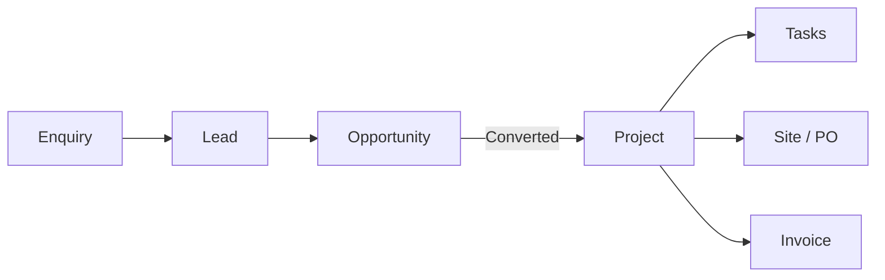

# Spaces — User Guide & Links

**Architecture & interior studio desk** on ERPNext v16, white-labelled as **Spaces**.

Use this page as your bookmark: every login, workspace link, form URL, and day-to-day flow in one place.

| | |
|--|--|
| **Live desk** | [https://spaces.keyteller.com/desk](https://spaces.keyteller.com/desk) |
| **Studio Web** | [https://spaces.keyteller.com/studio/](https://spaces.keyteller.com/studio/) (after deploy; local dev: `apps/studioweb`) |
| **Brand** | Spaces |
| **Company (ERP)** | `space` · AED · UAE |
| **Last baseline** | Jul 2026 — pilot dummy data seeded |

**Other docs:** **[Quick start (logins + links)](./QUICK-START.md)** · **[Product glossary](./docs/PRODUCT-GLOSSARY.md)** (studio code, job stage, money language) · **[Studio Web built inventory](./apps/studioweb/STUDIO-WEB-BUILT.md)** · **[Studio Web checklist](./apps/studioweb/STUDIO-WEB-CHECKLIST.md)** · **[Owner dashboard (pitch + flows)](./OWNER-DASHBOARD.md)** · **[Capabilities walkthrough](./WALKTHROUGH.md)** · **[Owner onboarding](./OWNER-ONBOARDING.md)** · [Verification & gaps](./VERIFICATION-GAPS.md) · [Platform sitemap](./PLATFORM-SITEMAP.md) · [Setup checklist](./STUDIO-SETUP-GUIDE.md) · [Technical runbook](./WHAT-WE-DID.md) · [Website webhook](./WEBHOOK-FORMS.md)

---

## Quick start (3 steps)

1. **Log in** → [https://spaces.keyteller.com/desk](https://spaces.keyteller.com/desk)
2. **Land on Studio Home** — sidebar shows: Home · Health · Pipeline · Projects · Site · Finance · Settings
3. **Follow one job** — Pipeline → Lead → Opportunity → set **Converted** → open Project in Projects

**Full tour of capabilities (12 flows, ~20–30 min):** **[WALKTHROUGH.md](./WALKTHROUGH.md)**

Demo data is already loaded (`[DEMO]` records). Use demo logins below to see each role’s view.

### Client journey (one line)



---

## Keyboard shortcuts

| Key | Action |
|-----|--------|
| **Ctrl+K** | Search anything (DocTypes, reports, settings) |
| **Ctrl+G** | Go to workspace / route |
| **Ctrl+S** | Save current form |
| **Ctrl+Shift+R** | Hard refresh if styling looks broken |

---

## All links

### Studio Web (thin UI)

Premium list/dashboard shell at `/studio/`. Same Frappe session cookie as desk. Desk code is **kept** (archived as primary UX only).

| Route | Purpose |
|-------|---------|
| `/studio/` | Home — cockpit cards, summary stats |
| `/studio/projects` | Projects — inline phase, status, Lead architect. SPOC / `communication_owner` is leftover stored data, not a product field ([ONTOLOGY-JTBD-ALIGNMENT.md](../03-product/ONTOLOGY-JTBD-ALIGNMENT.md) F5) |
| `/studio/pipeline` | Leads |
| `/studio/work` | Tasks — inline status, overdue highlight, Complete / Snooze |
| `/studio/opportunities` | Opportunities |
| `/studio/portfolio` | Portfolio health cockpit |
| `/studio/finance` | Finance — AR/AP/payments/reports/ledger; create + submit SI/PI/PE/JE |
| `/studio/site` | Site and Procurement — MR, PO, issues; create, assign, submit drafts |
| `/studio/sign-in` | Frappe login |

**Local dev:** `cd apps/studioweb/shadcn-admin && pnpm run dev` — see [apps/studioweb/README.md](./apps/studioweb/README.md).

### Public & desk

| What | URL |
|------|-----|
| **Desk (login)** | [https://spaces.keyteller.com/desk](https://spaces.keyteller.com/desk) |
| **Studio Web** | [https://spaces.keyteller.com/studio/](https://spaces.keyteller.com/studio/) |
| **Studio Home** | [https://spaces.keyteller.com/desk/workspaces/Studio%20Home](https://spaces.keyteller.com/desk/workspaces/Studio%20Home) |
| **Studio Portfolio** | [https://spaces.keyteller.com/desk/workspaces/Studio%20Portfolio](https://spaces.keyteller.com/desk/workspaces/Studio%20Portfolio) |
| **Pipeline** | [https://spaces.keyteller.com/desk/workspaces/Clients%20and%20Pipeline](https://spaces.keyteller.com/desk/workspaces/Clients%20and%20Pipeline) |
| **Projects** | [https://spaces.keyteller.com/desk/workspaces/Projects%20and%20Design](https://spaces.keyteller.com/desk/workspaces/Projects%20and%20Design) |
| **Site** | [https://spaces.keyteller.com/desk/workspaces/Site%20and%20Procurement](https://spaces.keyteller.com/desk/workspaces/Site%20and%20Procurement) |
| **Finance** | [https://spaces.keyteller.com/desk/workspaces/Studio%20Finance](https://spaces.keyteller.com/desk/workspaces/Studio%20Finance) |
| **Settings** | [https://spaces.keyteller.com/desk/workspaces/Studio%20Settings](https://spaces.keyteller.com/desk/workspaces/Studio%20Settings) |
| **Enquiry web form** | [https://spaces.keyteller.com/studio-enquiry](https://spaces.keyteller.com/studio-enquiry) |
| **Theme / branding** | Desk → Ctrl+K → **Theme Settings** |

### Forms — quick links

**Full sitemap** (every list, **new** form, reports, settings): **[PLATFORM-SITEMAP.md](./PLATFORM-SITEMAP.md)**

| DocType | List | New form |
|---------|------|----------|
| Lead | [/app/lead](https://spaces.keyteller.com/app/lead) | [/app/lead/new](https://spaces.keyteller.com/app/lead/new) |
| Opportunity | [/app/opportunity](https://spaces.keyteller.com/app/opportunity) | [/app/opportunity/new](https://spaces.keyteller.com/app/opportunity/new) |
| Project | [/app/project](https://spaces.keyteller.com/app/project) | [/app/project/new](https://spaces.keyteller.com/app/project/new) |
| Task | [/app/task](https://spaces.keyteller.com/app/task) | [/app/task/new](https://spaces.keyteller.com/app/task/new) |
| Sales Invoice | [/app/sales-invoice](https://spaces.keyteller.com/app/sales-invoice) | [/app/sales-invoice/new](https://spaces.keyteller.com/app/sales-invoice/new) |
| Purchase Order | [/app/purchase-order](https://spaces.keyteller.com/app/purchase-order) | [/app/purchase-order/new](https://spaces.keyteller.com/app/purchase-order/new) |

**Public form:** [/studio-enquiry](https://spaces.keyteller.com/studio-enquiry) only — no marketing site pages yet.

### API (when website is ready)

| What | URL |
|------|-----|
| **Lead webhook** | `POST https://spaces.keyteller.com/api/method/spaces_studio.api.webhook.create_lead_from_webhook` |
| **Auth header** | `X-Spaces-Webhook-Token: <secret>` |
| **Setup** | [WEBHOOK-FORMS.md](./WEBHOOK-FORMS.md) |

### Operations (VPS — admins only)

| What | Where |
|------|--------|
| **Server** | `ssh deploy@187.77.140.216` |
| **App path** | `/opt/spaces` |
| **Site name** | `spaces.keyteller.com` |
| **Deploy** | `DEPLOY_MODE=staging bash scripts/vps-deploy.sh` |
| **Studio setup** | `bash scripts/setup-studio.sh` |
| **Seed demo data** | `bash scripts/seed-dummy.sh` |
| **Purge demo data** | `bash scripts/purge-dummy.sh` |

---

## Logins

### Your team (real accounts)

Create users in **Settings → User**. Assign a **Role Profile** (not individual ERPNext roles).

| Person | Role profile | Opens |
|--------|--------------|-------|
| Owner / director | **Studio Principal Profile** | All desks |
| Designer / PM / architect | **Studio Design Lead Profile** | Home, Pipeline, Projects |
| Site / contracts | **Studio Site Profile** | Home, Projects, Site |
| Accountant | **Studio Finance Profile** | Home, Finance |

**Normalize an existing user** (strips Stock/Manufacturing noise, sets Studio Principal):

```bash
bench --site spaces.keyteller.com execute spaces_studio.setup.users.normalize_studio_user --kwargs '{"user_name": "you@studio.com"}'
```

### Demo accounts (pilot & training)

Password: **`SpacesDemo2026!`** (unless overridden on VPS)

| Email | Role | Use to test |
|-------|------|-------------|
| [owner@spaces-demo.local](mailto:owner@spaces-demo.local) | Studio Principal | Full access, settings |
| [ownerlite@spaces-demo.local](mailto:ownerlite@spaces-demo.local) | Studio Owner Lite | Owner menu without Admin |
| [lead.arch@spaces-demo.local](mailto:lead.arch@spaces-demo.local) | Studio Design Lead | Lead architect / Work hours (not Principal) |
| [architect1@spaces-demo.local](mailto:architect1@spaces-demo.local) | Studio Design Lead | Task assignment |
| [architect2@spaces-demo.local](mailto:architect2@spaces-demo.local) | Studio Design Lead | Task assignment |
| [architect3@spaces-demo.local](mailto:architect3@spaces-demo.local) | Studio Design Lead | Task assignment |
| [designer@spaces-demo.local](mailto:designer@spaces-demo.local) | Studio Design Lead | Design workflow |
| [finance@spaces-demo.local](mailto:finance@spaces-demo.local) | Studio Finance | Invoices, COA, reports |

Demo users use `@spaces-demo.local` — replace with real emails and names when ready; purge demo data first if you want a clean slate.

---

## The seven desks — what to open when

```text
Enquiry → Proposal → Project → Delivery → Invoice
 (Lead)   (Opportunity)  (hub)    (Site/PO)   (Finance)
```

| Sidebar | Workspace link | You come here to… |
|---------|----------------|-------------------|
| **Home** | [Studio Home](https://spaces.keyteller.com/desk/workspaces/Studio%20Home) | Command center: overdue tasks, fees due, sub payables, quick actions |
| **Portfolio** | [Studio Portfolio](https://spaces.keyteller.com/desk/workspaces/Studio%20Portfolio) | Burn %, phase pipeline, client collections, open ToDos |
| **Pipeline** | [Clients and Pipeline](https://spaces.keyteller.com/desk/workspaces/Clients%20and%20Pipeline) | Leads, opportunities, quotations, customers |
| **Projects** | [Projects and Design](https://spaces.keyteller.com/desk/workspaces/Projects%20and%20Design) | Projects, tasks, timesheets, files |
| **Site** | [Site and Procurement](https://spaces.keyteller.com/desk/workspaces/Site%20and%20Procurement) | Site issues, material requests, POs, suppliers |
| **Finance** | [Studio Finance](https://spaces.keyteller.com/desk/workspaces/Studio%20Finance) | Sales/purchase invoices, payments, journals |
| **Settings** | [Studio Settings](https://spaces.keyteller.com/desk/workspaces/Studio%20Settings) | Users, company, theme (Principal) |

**Rule:** After a job is won, **everything** links to the same **Project** — design tasks, site POs, and client invoices all carry that project.

### Who can do what

| Task | Principal | Owner Lite | Design Lead | Site | Finance |
|------|:---------:|:----------:|:-----------:|:----:|:-------:|
| Create Lead | yes | yes | yes | | |
| Opportunity / Quotation | yes | yes | yes | | read |
| Mark job won (Converted) | yes | yes* | | | |
| Tasks, files, timesheets | yes | yes | yes | read | |
| Site issues, MR, PO | yes | web* | | yes | read |
| Sales / Purchase Invoice | yes | yes | | | yes |
| Users and Admin | yes | | | | |
| Approve variations | yes | yes | | | |

\*Convert needs write on Opportunity. **Product UI is Studio Web only** for every role ([DESK-RETIREMENT.md](./DESK-RETIREMENT.md)). Desk is not for daily use.

**Full JTBD, user stories, config validation, gaps:** [ROLES-JTBD-USER-STORIES.md](./ROLES-JTBD-USER-STORIES.md)

### Already configured (baseline)

| Setting | Value |
|---------|-------|
| Selling — Customer Group | Commercial |
| Selling — Territory | United Arab Emirates |
| Company currency | AED |
| Active domains | CRM, Projects, Selling, Buying, Accounts |
| Smart Home | Off (lands on Studio Home) |

---

## By role — your typical day

### Studio Principal (owner / lead architect)

| Step | Where | Action |
|------|-------|--------|
| Morning | [Studio Home](https://spaces.keyteller.com/desk/workspaces/Studio%20Home) | Attention Required: overdue tasks, fees due, sub payables |
| Weekly review | [Studio Portfolio](https://spaces.keyteller.com/desk/workspaces/Studio%20Portfolio) | Burn, phase pipeline, collections, follow-up ToDos |
| New enquiry | [Pipeline](https://spaces.keyteller.com/desk/workspaces/Clients%20and%20Pipeline) | **Lead → New** or check web form submissions |
| Proposal | Pipeline | Lead → **Create → Opportunity**; optional Quotation PDF |
| Job won | Pipeline | Opportunity → **Status = Converted** → Project auto-created |
| Delivery | [Projects](https://spaces.keyteller.com/desk/workspaces/Projects%20and%20Design) | Assign tasks, update **Design Phase** |
| Billing | [Finance](https://spaces.keyteller.com/desk/workspaces/Studio%20Finance) | Sales Invoice on project |

### Studio Design Lead (architect / designer)

| Step | Where | Action |
|------|-------|--------|
| Tasks | [Projects](https://spaces.keyteller.com/desk/workspaces/Projects%20and%20Design) | Open **Task** list; update status |
| Time | Projects | **Timesheet** — hours per project |
| Files | Project or Task | Attach drawings (File) |
| Enquiries | [Pipeline](https://spaces.keyteller.com/desk/workspaces/Clients%20and%20Pipeline) | Create leads; read opportunities |

### Studio Site

| Step | Where | Action |
|------|-------|--------|
| Site report | [Site](https://spaces.keyteller.com/desk/workspaces/Site%20and%20Procurement) | **Issue** linked to project |
| Procurement | Site | **Material Request** → **Purchase Order** (project on header) |

### Studio Finance

| Step | Where | Action |
|------|-------|--------|
| Client bill | [Finance](https://spaces.keyteller.com/desk/workspaces/Studio%20Finance) | **Sales Invoice** — customer + project |
| Supplier cost | Finance | **Purchase Invoice** — supplier + project |
| Ledger | Finance | Chart of accounts, journal entries, project P&L reports |
| Payment | Finance | **Payment Entry** when client pays (needs bank account configured) |

---

## Demo pilot job (explore the full pipeline)

Seeded records are tagged **`spaces-demo-v1`** and titled with **`[DEMO]`**. Safe to purge anytime.

| Stage | What to search | Notes |
|-------|----------------|-------|
| Lead | `[DEMO] Al Reem Villa` | Project type: Interior |
| Opportunity | `[DEMO] Al Reem Villa Interior` | Status: Converted |
| Project | `PROJ-0002` (or matching title) | 10 milestone tasks, studio discipline Interior |
| Customer | `[DEMO] Al Reem Developments` | Auto-created on convert |
| Sales invoice | On project PROJ-0002 | Design stage fee (demo) |
| Purchase invoice | On project PROJ-0002 | Joinery / sampling (demo) |
| COA accounts | `[DEMO] Design Income`, etc. | Studio chart for finance review |

**Walkthrough**

1. Log in as `owner@spaces-demo.local` → [Pipeline](https://spaces.keyteller.com/desk/workspaces/Clients%20and%20Pipeline) → open demo Lead  
2. Open linked Opportunity → confirm **Converted** and **Linked Project**  
3. [Projects](https://spaces.keyteller.com/desk/workspaces/Projects%20and%20Design) → open project → see tasks (some assigned to demo architects)  
4. Log in as `finance@spaces-demo.local` → [Finance](https://spaces.keyteller.com/desk/workspaces/Studio%20Finance) → Sales / Purchase invoices on that project  

---

## Forms — minimum fields

### Lead (enquiry)

**Pipeline → Lead**

| Field | Required | Notes |
|-------|----------|-------|
| Lead Name | Yes | Person or company |
| Email / Phone | Yes | At least one |
| Project Type | Yes | Interior / Exterior / Landscape / Mixed — drives task template |
| Project Brief | Yes on web form | Plain-text scope (ERPNext v16 `notes` is a table, not text) |

### Opportunity (proposal)

**Pipeline → Opportunity**

| Field | Required | Notes |
|-------|----------|-------|
| Opportunity From | Lead | Links party |
| Project Type | Yes | Copy from lead |
| Opportunity Amount | Yes | Proposed fee (AED) |
| Expected Closing | Yes | Target award date |
| Notes | Yes | Scope in opportunity notes table |

### Job won → Project (automatic)

Set Opportunity **Status = Converted**. System creates Customer, Project, tasks from template, and **Linked Project** on the opportunity.

### Project (job hub)

| Field | When |
|-------|------|
| Studio Discipline | Auto (Interior / Exterior / Landscape / Mixed) |
| Design Phase | Update: Brief → Concept → … → Handover |
| Site Address | When known |
| Client Brief | Refine scope |

### Sales Invoice

**Finance → Sales Invoice** — Customer + **Project** + fee line items.

---

## Public enquiry form

**Validate here before wiring the marketing website.**

| | |
|--|--|
| **URL** | [https://spaces.keyteller.com/studio-enquiry](https://spaces.keyteller.com/studio-enquiry) |
| **Creates** | Lead in Pipeline |
| **Fields** | Name, email, phone, project type, company (optional), project brief |

Submissions appear in **Pipeline → Lead**. When the public site is ready, use the webhook ([WEBHOOK-FORMS.md](./WEBHOOK-FORMS.md)) so clients never see the ERP desk.

---

## Demo data — on, off, purge

| Action | Command (on VPS `/opt/spaces`) |
|--------|--------------------------------|
| **Seed everything** | `bash scripts/seed-dummy.sh` |
| **Remove all demo** | `bash scripts/purge-dummy.sh` |
| **Status** | `bench --site spaces.keyteller.com execute spaces_studio.setup.dummy_data.dummy_data_status` |
| **Owner audit** | `bench --site spaces.keyteller.com execute spaces_studio.setup.audit.owner_readiness_audit` |

| Tag | Meaning |
|-----|---------|
| `spaces-demo-v1` | Hidden field on demo records — used for purge |
| `[DEMO]` | Visible in titles |
| `*@spaces-demo.local` | Demo user emails |

Toggle config: `spaces_studio_dummy_data_enabled` (1 = on, 0 = off).

---

## Configuration checklist

**Platform (once)**

- [ ] Company: name, currency (AED), country (UAE)
- [ ] Selling Settings: Customer Group **Commercial**, Territory **United Arab Emirates**
- [ ] Theme: logo, **Spaces**, Smart Home **off**
- [ ] Users: correct **Role Profile** per person
- [ ] Domains: CRM, Projects, Selling, Buying, Accounts active

**Pilot (prove the pipeline)**

- [ ] Lead with project type
- [ ] Opportunity → **Converted** → project + tasks
- [ ] Task assigned and progressed
- [ ] Sales invoice on project
- [ ] Finance login sees invoices & COA

**Website (later)**

- [x] Webhook token configured (auto via `verify-and-ship.sh` — 2026-07-13)
- [ ] Smoke-test creates Lead
- [ ] Optional: email notify Principal on new lead

---

## Troubleshooting

| Problem | What to do |
|---------|------------|
| Blank workspace page | On VPS: `bench execute spaces_studio.setup.workspaces.ensure_workspaces` + `clear-cache` — see [WHAT-WE-DID.md](./WHAT-WE-DID.md) |
| User sees Stock / Manufacturing | `normalize_studio_user` + re-login |
| Converted but no project | Check opportunity title; check Error Log in desk |
| Wrong tasks on project | Set **Project Type** on Lead before Opportunity |
| Web form fails | Ensure `project_brief` field exists; re-run `seed-dummy.sh` |
| Payment entry won’t submit | Configure company **bank account** in ERPNext |
| Styling broken | Hard refresh (Ctrl+Shift+R); run `bash scripts/materialize-assets.sh` on VPS |

---

## Related documentation

| Document | Best for |
|----------|----------|
| **[USER-GUIDE.md](./USER-GUIDE.md)** (this file) | Links, logins, day-to-day use |
| [PLATFORM-SITEMAP.md](./PLATFORM-SITEMAP.md) | **Full platform sitemap** — all forms, reports, workspaces |
| [STUDIO-SETUP-GUIDE.md](./STUDIO-SETUP-GUIDE.md) | One-time setup, forms reference, checklist |
| [STUDIO-WORKFLOW.md](./STUDIO-WORKFLOW.md) | End-to-end design, phases, CMS options |
| [WEBHOOK-FORMS.md](./WEBHOOK-FORMS.md) | Website → Lead integration |
| [WHAT-WE-DID.md](./WHAT-WE-DID.md) | Deploy, recover, technical fixes |
| [README.md](./README.md) | Repo overview & deploy commands |
| [VERTICAL-STRATEGY.md](./VERTICAL-STRATEGY.md) | Cloning studio for other verticals |

---

*Spaces · [spaces.keyteller.com](https://spaces.keyteller.com/desk)*